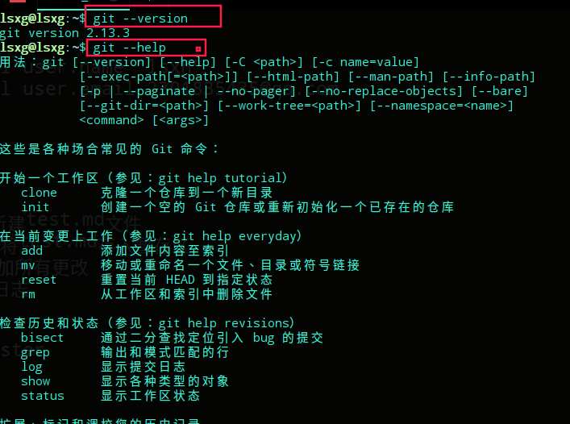
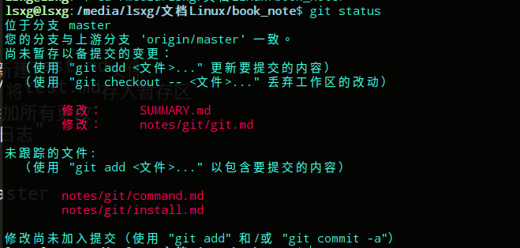

# git常用命令

## 基本命令

显示git --help命令

```bash
git --help
```



查看git当前的状态

```bash
git status
```



查看版本

```bahs
git --version
```

## git创建项目1

初始化git项目

```bash
git init
```

给项目建分支加仓库地址

```bash
git remote add origin url
```

## git创建项目2

克隆项目

```bash
git clone url
```

## 提交推送

git暂存(.所有)

```bash
git add .
```

添加提交日志

```bash
git commit -m "info"
```

推送到远程仓库

```bash
git push origin master
```

拉取

```bash
git pull origin master
```