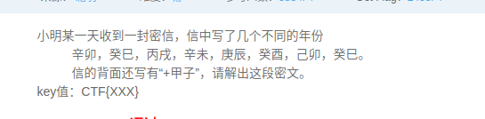

# 密码相关笔记

- [在线解码、编码](http://bianma.911cha.com/)  
- [base64与图片的转换](http://www.vgot.net/test/image2base64.php?)  
- 古典密码：置换密码(列置换，周期置换)、代换密码(单表代换密码(凯撒，乘法)，多表代换密码(vernam,Playfair))  
  - 凯撒密码：交换加密(通过对原字符按特定的变换进行加密)
  - 乘法密码：A和B是有n个字母的字母表。定义一个由A到B的映射：f:A→B f(ai )= bi= aj j=ik mod n 其中，(n,k)=1
  - Vernam：明文、密文、密钥都表示为二进制位
  - Playfair:用密钥控制生成矩阵(5*5,i/j为同一个)，然后每两个字母为单位进行代换(字母如果相同插入x，最后剩余一个字母补一个x)，不同行对角替换，同行左移替换。
  - Hill(乘积密码)：建立在矩阵相乘的基础上，但不能抵抗已知明文攻击。  
- 敲击码(一窜数字)：基于5×5方格波利比奥斯方阵来实现的，不同点是是用K字母被整合到C中。《闪电侠》中使用过  
- ADFGX加密：`ADFGX*ADFGX`(组成`5*5`的方阵i/j为同一个)
- 加盐密码:解密后去掉盐
- RAS加密算法：RSA的算法涉及三个参数，n、e、d。其中，n是两个大质数p、q的积，n的二进制表示所占用的位数，就是所谓的密钥长度。e和d是一对相关的值，e可以任意取，但要求e与(p-1)*(q-1)互质；再选择d，要求(d*e)mod((p-1)*(q-1))=1。（n，e),(n，d)就是密钥对。其中(n，e)为公钥，(n，d)为私钥。RSA加解密的算法完全相同，设A为明文，B为密文，则：A=B^d mod n；B=A^e mod n；（公钥加密体制中，一般用公钥加密，私钥解密）  
- 维吉尼亚加密：（第一行为明文，第一列为秘钥）明文与秘钥一样长  
- 邮件编码(UUencode)：($T\J\_@``)[在线解码](http://web.chacuo.net/charsetuuencode)  
- Brainfuck:(`+[>+-.>+.`)、Ook:(`Ook!`)(`.!?`)[在线解码](https://www.splitbrain.org/services/ook)|[在线解码](https://www.nayuki.io/page/brainfuck-interpreter-javascript)|[在线解码](http://esoteric.sange.fi/brainfuck/impl/interp/i.html)  
- Url(%):[站长工具](http://tool.chinaz.com/tools/urlencode.aspx)  
- XXencode:将输入文本以每三个字节为单位进行编码。如果最后剩下的资料少于三个字节，不够的部份用零补齐。(末尾容易出现'+'号)[在线解码、编码](http://web.chacuo.net/charsetxxencode)  
- [DES、AES、Rabbit、RC4、TripleDes加密解密](http://tool.oschina.net/encrypt/)
  - DES对称加密：一般使用蛮力会密钥搜索破解  
  - AES对称密码，旨在取代DES一般有较多`+`号  
  - Rabbit加密：(与base64相似)  
  - RC4加密：  
  - 图片与base64转换  

- [VB script、JS、ASP在线解码](http://www.zhaoyuanma.com/aspdecode.php)(`#@~^EQAAAA==VXlj4UmkaYAUmKN3bAYAAA==^#~@`)  
  - ASP加密：  
  - VB script encode:一般会出现一些比较奇怪的字符。  
  - JS加密：
- jsfuck：(`[][(![]+[])[+[]]`):浏览器Console直接输出  
- 颜文字(aadecode):`ﾟωﾟﾉ= /｀ｍ´`[在线解码、编码](https://cat-in-136.github.io/2010/12/aadecode-decode-encoded-as-aaencode.html)浏览器Console直接输出  
- jother：Console输出  
- Serpent加密:(Serpent蛇)Rijndael、Serpent、Twofish，这三种算法当时作为AES的候选算法，各有长短：Serpent被认为最安全，而Rijndael速度最快，Twofish则居中  

## 变异的凯撒

  
直接使用凯撒解密得到的结果，显然不对

考虑到"变异"分析密文，f-a=5 _-Z=6,因此可能是递增的进行了凯撒加密

## 传统知识+古典密码

  
对六十甲子年份分析得到一窜数字，"+甲子"，每个数字加60，然后进行ASCII码装换。古典密码考虑栅栏和凯撒。将装换后的字母先进行栅栏解密，得到两栏，分别进行凯撒解密。得到'shuangyu'  

  
"key值：CTF{XXX}"提交注意格式

## 古典密码

  
提示1中加密的方法就在迷面中而题中是一窜数字，首先考虑装换为ASCII码，装换后发现还是没有什么规律，但注意到'{}',提示2"key值固定的结构"，又是古典密码，想到列置换。
  
按7X5排列，提交格式:CTF{}  
  
进行列置换  2764513 得到有规律的一句话

## try them all

You have found a passwd file containing salted passwords. An unprotected configuration file has revealed a salt of 5948. The hashed password for the 'admin' user appears to be 81bdf501ef206ae7d3b92070196f7e98, try to brute force this password.
(加盐密码：盐(5948)密文(81bdf501ef206ae7d3b92070196f7e98))
考虑MD5加密，MD5解密后去掉末尾的盐得到答案

## trivial

  
下载源码分析，可以知道是一个加密函数，现在有了加密后的结果和加密的key，要反推出明码。
  

```python
alphaL = "abcdefghijklnmopqrstuvqxyz"
alphaU = "ABCDEFGHIJKLMNOPQRSTUVQXYZ"
num    = "0123456789"
keychars = num+alphaL+alphaU
key = 'T0pS3cre7key'
ciphertext = 'Bot kmws mikferuigmzf rmfrxrwqe abs perudsf! Nvm kda ut ab8bv_w4ue0_ab8v_DDU'

plaintext = ""
for i in range(len(ciphertext)):
    rotate_amount = keychars.index(key[i%len(key)])
    if ciphertext[i] in alphaL:
        enc_char = ord('a') + (ord(ciphertext[i]) - ord('a') - rotate_amount) % 26
    elif ciphertext[i] in alphaU:
        enc_char = ord('A') + (ord(ciphertext[i]) - ord('A') - rotate_amount) % 26
    elif ciphertext[i] in num:
        enc_char = ord('0') + (ord(ciphertext[i]) - ord('0') - rotate_amount) % 10
    else:
        enc_char = ord(ciphertext[i])
    plaintext = plaintext + chr(enc_char)
print(plaintext)
```

## robomunication

  
下载后是一个 .MP3的文件打开一听，里面只有 bi bu 停顿，想到摩斯密码
翻译后解密成功

## Flash-14

  
闪电侠第十四集中的一个加密方式 11->A,12->B  
  

54 43 32 52 22 44 55 34 22 51 52 22 44 34 22 23 11 34 12  
YSMWGTZOGVWGTOGHAOB  
对其进行凯撒解码  
  
最后注意提交格式ctf{flashisfastman}

## RSARSA


  
题目中已经给出了p q e所以只需求出d然后对c解密即可

```python
import math
p = 
q = 
e = 
# 明文，密文
c = 
N = p*q
fN = long((p-1)*(q-1))
i = 1
while True:
    x = i*fN + 1
    if 0==x%e:
        d = x/e
        break
    i+=1
print(pow(c,d,N))
```

## RSAROLL


  
猜测第一行为公钥（n,e），使用欧拉公式对n分解，求出p，q，再求出私钥（n，d），使用私钥对下面的所有数据进行解密。将得到的数字装换为ASCII码得到最后的结果

```python
import math
def moder(n):
    base=2
    while base <math.sqrt(n):
        if(n%base==0):
            fbase=base
            print(base,int(n/base))
        base+=1
    pass
    f=getEuler(fbase,int(n/fbase))
    print('f(n)欧拉函数值：%d'%f)#
    return f

# 求欧拉函数f(n)
def getEuler(prime1, prime2):
    return (prime1-1)*(prime2-1)

# 19d - 920071380k= 1
# 求私钥d
def getDkey(e, Eulervalue):#可以辗转相除法
    k = 1
    while True:
        if (((Eulervalue * k) + 1) % e) == 0:
            (d,m)=divmod(Eulervalue * k + 1,e)
            return d#避免科学计数法最后转int失去精度
        k += 1


if __name__=='__main__':

    # 公钥(n,e) 私钥(n,d)
    n = 920139713
    e = 19
    d =getDkey(e, moder(n))
    print('私钥为： %d'%d)
    c=[704796792,752211152,274704164,18414022,368270835,483295235,263072905,459788476,483295235,459788476,663551792,475206804,459788476,428313374,475206804,459788476,425392137,704796792,458265677,341524652,483295235,534149509,425392137,428313374,425392137,341524652,458265677,263072905,483295235,828509797,341524652,425392137,475206804,428313374,483295235,475206804,459788476,306220148]
    L=[]
    for x in c:
        L.append(pow(x,d,n))  # 解出明码
    print(L)
    #明文ascii表
    for x in L:
        print(chr(x),end='')
```

## 围在栅栏中的爱


先进行摩斯解码得到：KIQLWTFCQGNSOO  
QWE题目中有QWE=ABC提示想到QWE加密（电脑键盘排序加密）  
装换得到(两种情况列出对的情况)：RHASBENVAOYLII  
进行栅栏解码得到第一栏(从后往前读)  
  
注意提交格式，CTF{小写}

## 疑惑的汉字

  
数汉字的出头数，查ASCII表得到结果

## 奇妙的音乐

  
下载得到一个123.zip,解压出一张图片和一个要密码的music.zip  
  
尝试使用steghide处理图片发现没有隐藏信息，由图片想到盲文，对照得到：kmdonowg(压缩包的密码)使用Audacity处理music.wav  

  
用摩斯解码得到  
  
按格式提交发现错误。对null对应的摩斯密码单独放到在线工具解码得到'？'  
提交格式：CTF{wpei08732?23dz}  

## Fair-Play

  
两行，一行为Fail，一行为Play  
The quick brown fox jumps over the lazy dog!  
       ihxo{smzdodcikmodcismzd}  
第一行生成5*5的密钥矩阵  
第二行两两拆分：ih xo sm zd od ci km od ci sm zd  
带入矩阵进行替换得到：ctfplayfairisfairplay  

## Decode

题目为decode应该要进行了各种解码(Unicode编码、UTF-8：&#,\u;Url编码：%，NATIVE(转ASCII):\u)，数字中多次出现25应该是某个符号  
打开解题连接得到开头0x的数字，考虑将数字两两分离再转化为10进制整数，再转化字符，对字符进行url解码，得到base64密文，解码得到ASCII，最后转换为字符窜。  
  
  
[在线解码](http://bianma.911cha.com/)  

```python
a = "253464253534253435253335253433253661253435253737253464253531253666253738253464253434253637253462253466253534253662253462253464253534253435253738253433253661253435253737253466253531253666253738253464253434253435253462253464253534253435253332253433253661253435253738253464253531253666253738253464253534253535253462253464253534253431253330253433253661253435253737253465253531253666253738253464253661253435253462253466253534253633253462253464253534253435253737253433253661253662253334253433253661253662253333253433253661253435253738253465253431253364253364"
re = ''
for i in range(0,len(a),2):
    x = chr(int(a[i]+a[i+1],16))
    re += x
print(re)

b = [119,101,108,99,111,109,101,116,111,115,104,105,121,97,110,98,97,114]
res = ''
for i in b:
    y = chr(i)
    res += y
print(res)
```

## 杯酒人生

  
题目为古典密码，而且含有密钥，考虑维吉尼亚加密。  
首先对加密的密钥进行凯撒解密得到密钥：COMPUTER  
  
通过维吉尼亚加密求出结果：DZAREVMGJSDSYLMXPDDXHVMGNS  

```python
#  -*-coding:UTF-8 -*-
"""维吉尼亚的加密解密"""

# ascii的大小写又密码决定
# ascii='abcdefghijklmnopqrstuvwxyz'
ascii='ABCDEFGHIJKLMNOPQRSTUVWXYZ'


def  jiami(key,plaintext,keylen,ptlen):
    """加密"""
    ciphertext = ''
    i = 0
    while i < ptlen:
        j = i % keylen
        k = ascii.index(key[j])
        m = ascii.index(plaintext[i])
        ciphertext += ascii[(m+k)%26]
        i += 1
    return ciphertext

def jiemi(key,ciphertext,keylen,ctlen):
    """解密"""
    plaintext = ''
    i = 0
    while i < ctlen:
        j = i % keylen
        k = ascii.index(key[j])
        m = ascii.index(ciphertext[i])
        if m < k:
            m += 26
        plaintext += ascii[m-k]
        i += 1
    return plaintext


def main():
    key='COMPUTER'
    ciphertext = 'BLOCKCIPHERDESIGNPRINCIPLE'
    plaintext = jiemi(key,ciphertext,len(key),len(ciphertext))
    print(plaintext)
    key='COMPUTER'
    plaintext = 'BLOCKCIPHERDESIGNPRINCIPLE'
    ciphertext1 = jiami(key,plaintext,len(key),len(plaintext))
    print(ciphertext1)


if __name__ == "__main__":
    main()
```

## 一串奇怪的数

  
  
看到提示以及加密算法，自然就想到编程逆推。  
注：在这个加密程序中strPassword为空

```python
#coding:utf-8
import hashlib

def md5(s):
    return hashlib.md5(s).hexdigest()

def evalCrossTotal(strMd5):
    r = 0
    for i in strMd5:
        r += int("0x%s" % i, 16)
    return r

def encryptString(strString, strPasswd):
    strPasswdMd5 = md5(strPasswd)
    intMd5       = evalCrossTotal(strPasswdMd5)

    r = []

    for i in range(len(strString)):
        r.append(
            ord(strString[i]) + \
            int("0x%s" % strPasswdMd5[i%32], 16) - \
            intMd5
        )
        intMd5 = evalCrossTotal(
            md5(strString[:(i+1)])[:16] + \
            md5(str(intMd5))[:16]
        )
    return " ".join(map(lambda x: str(x), r))

def decryptString(r,strPasswd):
#前两句不变
    strPasswdMd5 = md5(strPasswd)
    intMd5       = evalCrossTotal(strPasswdMd5)
#求逆
    strString = ""
    #len(r)代表tuple元素个数。。。。可以看出r的元素个数和strString的字符数是相同的
    for i in range(len(r)):
        strString+=chr(r[i] - int("0x%s" % strPasswdMd5[i%32], 16) + intMd5)#自己理解
        intMd5 = evalCrossTotal(md5(strString[:(i+1)])[:16] + md5(str(intMd5))[:16])#没有变
    return strString

if __name__ == '__main__':
    s="-149 -234 -157 -132 -187 -140 -157 -241 -158 -177 -85 -215 -180 -187 -173 -218 -161 -183 -133 -226 -136 -171 -126 -169 -155 -96 -169 -240 -163 -153 -137 -111 -123 -191 -151 -213 -151 -142 -152 -208 -118 -137 -136 -244 -157 -168 -187 -201 -170 -176 -192 -209 -205 -174 -163 -189 -126 -133 -148 -194 -145 -212 -170 -155 -148 -165 -167 -206 -171 -177 -88 -173 -125 -129 -129 -235 -121 -190 -161 -165"
    r=eval('[%s]' %s.replace(' ',','))#eval可以把list,tuple,dict和string相互转化。
    strPasswd='' #密钥为空
    print(decryptString(r,strPasswd))
```

## js


```js
eval(
    function(p,a,c,k,e,d)
    {
        e=function(c)
        {
            return(c35?String.fromCharCode(c+29):c.toString(36))
        };
        if(!''.replace(/^/,String)
            {
                while(c--)d[e(c)]=k[c]||e(c);k=[function(e)
                {
                    return d[e]}];e=function()
                    {
						return'\\w+'};c=1;
					};
					while(c--)
						if(k[c])
							p=p.replace(new RegExp('\\b'+e(c)+'\\b','g'),k[c]);
						return p;
					}('<1 8="7/a">9(\'\\6\\3\\2\\5\\4\\b\\i\\h\\k\\j\\0\\g\\d\\c\\f\\0\\e\')',21,21,'u0065|script|u006d|u0069|u0054|u0043|u0053|text|type|alert|javascript|u0046|u006f|u0063|u007d|u0064|u006e|u006a|u007b|u005f|u0073'.split('|'),0,{}))
```

最后一段中按'|'分割，明显是Unicode，在u前面加上'\'，解码得到  
  
由题中的提交格式，或分析代码得出：SimCTF{js_encode}  

## keybord

  
打开连接是：BHUK,LP TGBNHGYT BHUK,LP UYGBN TGBNHGYT BHUK,LP BHUK,LP TGBNHGYT BHUK,LP TGBNHGYT UYGBN  
  
按顺序在键盘上画出结果：NBNCBNNBNBC  

## 一个img文件

[题目链接http://www.shiyanbar.com/ctf/60](http://www.shiyanbar.com/ctf/60)  
涉及AES加密，下载得到一个.zip 解压出data.img的镜像文件，镜像损坏无法直接加载。使用Diskgenius打开，恢复数据可以得到一个data_encoded文件(不知道干什么用的，估计是密钥)  

```bash
sudo apt-get install aeskeyfind
```

安装一个小插件对解压得到的data.img分析

```bash
aeskeyfind ./data.img
```

得到：  
3ae383e2163dd44270284f1554d9be8d  
3ae383e2163dd44270284f1554d9be8d  
cda2bdc8f20c46db216c0a616cd11e11  
估计是密文。  
由密钥和密文使用AES解密(不会)。  
(错误操作：看到一个.img格式的镜像，我就试着该了一下后缀名，发现没什么用，就无法使用`binwalk`拆包了，`steghide`也无法操作)  

## 数码管

  
下载得到下图  
  
有颜色的七段数码管想到共阴共阳，转换为16进制

  
最后2列对应的十六进制：  
[0x76', '0x38', '0x37', '0x3e', '0x73', '0x5c', '0x40', '0x0']  
得到答案

## [这里没有key](http://www.shiyanbar.com/ctf/7)

查看页面源代码得到  
`#@~^TgAAAA=='[6*liLa6++p'aXvfiLaa6i[[avWi[[a*p[[6*!I'[6cp'aXvXILa6fp[:6+Wp[:XvWi[[6+XivRIAAA==^#~@`  
[VB script 在线解码](http://www.zhaoyuanma.com/aspdecode.php)得到 ：`&#x45;&#x6e;&#x63;&#x6f;&#x64;&#x65;&#x40;&#x64;&#x65;&#x63;&#x6f;&#x64;&#x65;`  
看似Unicode，站长工具Unicode解码得到：Encode@decode  

## 最近一直在纠结一个问题，先有鸡还是先有蛋

  
题目中字母很没规律，尝试了各种解码都不行。每几个字符中间有空格，想到之前做的一个keyboard的题，在键盘上试了一下，画出三个圈。答案就是圈中的字母。  

## NSCTF crypto50

神秘的字符串：U2FsdGVkX1+qtU8KEGmMJwGgKcPUK3XBTdM+KhNRLHSCQL2nSXaW8++yBUkSylRp  
有较多的`+`号，猜测是AES,解密得到：flag{DISJV_Hej_UdShofjyed},提交答案不对，对{DISJV_Hej_UdShofjyed}进行凯撒解密得到：{NSCTF_Rot_EnCryption}目测就是答案。flag{}

## NSCTF crypto200

[题目链接](http://www.shiyanbar.com/ctf/1768)  
  
下载得到newnewnew.jpg  
  
Stegsolve打开QR扫码得到结果  
  

## easy

[题目链接](https://cgctf.nuptsast.com/challenges#Crypto)bmN0Znt0aGlzX2lzX2Jhc2U2NF9lbmNvZGV9  
  
base64解密得到flag

## 他的情书

[他的情书](http://www.shiyanbar.com/ctf/1812)点看链接是个很有意思的页面，只能通过F12来看源代码，有干扰有提示，对love中的Url解码得到：

```js
eval(function(p,a,c,k,e,d){}
```

百度找到[eval(function(p,a,c,k,e,d){}](https://www.jb51.net/article/9705.htm)的解码器,解码得到：

```js
function zhegejiamiyidiandoubuku()
{
var pass=document.form.passwd.value;
var cry="Rm9yM0re354v5E4FUg5FasDboooo==";
var addr='soroki.php?passwd=';
var locatie=location.href;
var out='';
var pass2=cry.substring(15,4*4)+cry.substring(24,5*5)+cry.substring(0,1)+cry.substr(7,1)+cry.substr(11,1)+cry.substr(13,1)+cry.substring(3+3,7);
pass=locatie.substr(locatie.indexOf('?')+1);
addr=addr.substring(0,addr.indexOf('?')+1)+'l0vau=';
for(i=0;i<pass.Len;i++)
{
    if(pass.charAt(i)==pass2.charAt(i))
    {
    document.write(pass.charAt(i))
    }
}
location=addr+pass
}
```

location = soroki.php?l0vau=FoRevEr  
在解题链接后加上location得到:`aW4yIHNheTpJIGxvdmUgeW91IEZvcmV2ZXIhVGhlIEdpcmwgc2F5OiB6cWN7ZmtxdGxfZnBfeWZkX3B5fQ==`  
base64解码，凯撒解码  
  
[情书.txt](./crypto/情书.txt)  

## 凯撒和某某加密

  
写c++脚本对ASCII进行位移解密得到类似答案  
  

```c++
# include <iostream>
# include <stdio.h>
# include <string.h>
# include <ctype.h>

using namespace std;

# define MAX 100

int main()
{
    char str[MAX] = "aZZg/x\\ZbavpZiEZp+n)o+";
    int f;
    cout<<"向前位移(1),向后位移(-1):";
    scanf("%d",&f);
    if(f>0)
    {
        while(true)
        {
            for(int i=0;i<strlen(str);i++)
            {
                str[i]+=1;
            }
            cout<<str<<endl;
            getchar();
        }
    }
    if(f<0)
    {
        while(true)
        {
            for(int i=0;i<strlen(str);i++)
            {
                str[i]-=1;
            }
            cout<<str<<endl;
            getchar();
        }
    }
    return 0;
}
```

## [BugkuCTF训练平台](http://ctf.bugku.com/challenges)

### 密码

  
KEY{zs19970315}

### 简单加密

  
`e6Z9i~]8R~U~QHE{RnY{QXg~QnQ{^XVlRXlp^XI5Q6Q6SKY8jUAA`  
目测为凯撒，解密不对，应该是base64和凯撒，凯撒爆破。  

base64解密  
  

### 一段base64

  
[一段base64.txt](./crypto/一段base64.txt)  
  
  
  
  
在线将结果Unicode转中文，然后url解密得到结果  
  
  
flag{ctf_tfc201717qwe}

### ok .!? +[]-

[在线解码](https://www.splitbrain.org/services/ook)  
  

### 奇怪的密码

  
字符串的内容不多，格式也比较符合flag{}  
gndk的ASCII码：103 110 100 107  
flag的ASCII码：102 108  97  103  
明显为+1 +2 +3 +4

### 托马斯.杰斐逊

  
  
  
flag{XSXSBUGKUADMIN}小写提交  

### 告诉你一个秘密

  
两两拆分转ASCII，得到下面结果  
  
看似base64，解密  
  
在键盘对应位置中间得到flag:tongyuan,大写提交  

```python
# -*- coding:utf-8 -*-
a = '636A56355279427363446C4A49454A7154534230526D684356445A31614342354E326C4B4946467A5769426961453067'
res = ''
for i in range(0,len(a),2):
    res += chr(int(a[i:i+2],16))
print (res)
# cjV5RyBscDlJIEJqTSB0RmhCVDZ1aCB5N2lKIFFzWiBiaE0g
```

### 来自宇宙的信号

  
下载得到20171021180829.jpg  
  
用各种软件打开没什么特别（隐写），百度找到标准银河字母，对照得到：nopqrst


### zip伪加密

  
下载得到[flag.zip](./crypto/flag.zip)，有密码，尝试了爆破，不行，伪加密上ZipCenOp.jar得到结果  
  


## 常用加密图片

- 电脑键盘QWE加密法  
    
- 猪圈密码加密解密  
    
- ADFGX加密法  
    
    
- 电脑键盘QWE加密法:  
    
- 电脑键盘坐标加密  
    


  https://www.tuicool.com/articles/2E3INnm