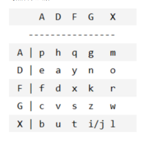
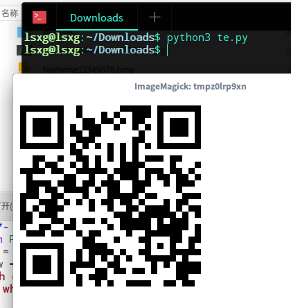
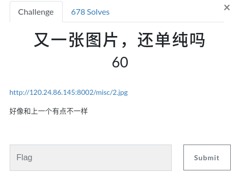
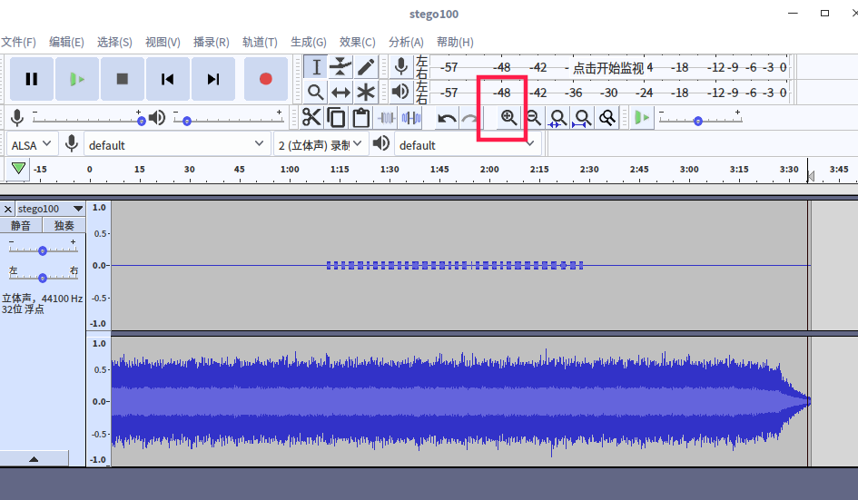

# 安全杂项

- XOR异或加密：1^0 = 1,1^1 = 0
- robots协议：(网络爬虫协议)链接处加上robots.txt  
- [base64与图片的转换](http://www.vgot.net/test/image2base64.php?)  
- 图片在Linux下无法显示(打开空白)，Windows下正常显示，一般图片是被截取了，修改宽高。  

## 功夫秘籍

[题目连接](http://www.shiyanbar.com/ctf/1887)下载得到一个[kungfu.rar](./sundry/kungfu.rar)使用binwalk查看发现是png文件，将其后缀改为png  
  
得不出其他信息，使用winhex打开，最后有提示  
  
baes63解码：T_ysK9_5rhk__uFMt}3El{nu@E  
栅栏解码：(base64解码得到的结果最后有空格，不能少了否则栅栏解码出错)  
第1栏：Ts_h_M3{@_K5kutEnEy9r_F}lu  
第2栏：Th3_kEy_ls_{Kun9Fu_M@5tEr}  

## 紧急报文

[原题连接](http://www.shiyanbar.com/ctf/1955)  
内容：  
解密一下这份截获的密文吧，时间就是机会！  
FA XX DD AG FF XG FD XG DD DG GA XF FA  
flag格式:flag_Xd{hSh_ctf:******}  
显然应该是使用ADFGX加密法对照表得到结果(表与百度上的不一致，不理解)  
  

## 64格

[64格题目连接](http://www.shiyanbar.com/ctf/1857)，下载得到[64格.rar](./sundry/64格.rar)，解压出gif图片，补全gif的头部  
  
  
根据小黄人所在的位置对应64进制表得到：Q1RGe2FiY19kZWZfZ30  
base64解码：CTF{abc_def_g}  

## 异性相吸

[异性相吸连接](http://www.shiyanbar.com/ctf/1855),下载得到[yx.zip](./sundry/yx.zip)  解压(明文.txt、密文.txt)  
异性相吸想到异或(^)  

```python
# -*- coding: utf-8 -*-
import os
a = open('密文.txt', 'rb').read()
b = open('明文.txt', 'rb').read()
result = ''
for i in range(0, len(a)):
    temp = ord(list(a)[i]) ^ ord(list(b)[i])
    result += chr(temp)
print(result)
```

得到：flag:nctf{xor_xor_xor_biubiubiu}  

## Snake(未解)

[原题链接](http://www.shiyanbar.com/ctf/1851)下载得到[snake.jpg](./sundry/snake.jpg)  
  
binwalk 查看发现含有zip,`binwalk -e snake.jpg`  
  
百度 `What is Nicki Minaj's favorite song that refers to snakes?`似乎得到:anaconda  
然后用serpent加密算法解密cipher文件，应该就是结果。(没写出serpent解密算法)  

## Paint_Scan（坐标转二维码）

[原题链接](http://www.shiyanbar.com/ctf/1860)下载得到[Paint_Scan.zip](./sundry/Paint_Scan.zip)解压得到Paint_Scan.txt,文件内全是坐标，所以将坐标转换为二维码。

```python
# -*- coding:UTF-8 -*-
from PIL import Image, ImageDraw
img = Image.new("RGB", (512, 512), "white")
draw = ImageDraw.Draw(img)
with open('Paint_Scan.txt', 'r') as f:
    while True:
        line = f.readline().strip()
        # print(line)
        if not line:
            break
        # draw.point()
        exec('draw.point(' + line + ', fill = (0, 0, 0))')
        # print('draw.point(' + line + ', fill = (255, 0, 0))')

img.show()
```

  

## WTF?(01转二维码)

  
打开是base64加密的内容，解密得到大量01，保存到[img.txt](./sundry/img.txt),运行Python生成二维码。  

```python
# -*-coding:UTF-8 -*-
from PIL import Image
img = Image.new('RGB',(256,256))
pix = img.load()
with open('img.txt') as f:
    txt=f.read()
    for x in range(len(txt)-1):
        if txt[x] == '1':
            pix[x//256,x%256]=(0,0,0)
        else:
            pix[x//256,x%256]=(255,255,255)
img.show()
```

  

## 女神（文件转图片）

  
[题目链接](http://www.shiyanbar.com/ctf/724)下载得到[nvshen.zip](./sundry/nvshen.zip)  
解压得到nvshen.txt,目测是base64加密过的。  
运行python得到图片，百度识图，得到名字。去掉中间的点提交。

```python
open('nvshen.png','wb').write(open('nvshen.txt','rb').read().decode('base64'))
```

## 解码磁带

[解密磁带原题连接](http://www.shiyanbar.com/ctf/1891)  
  
使用摩斯、培根对Being加密，不对应，想到二进制ASCII，o->1,_->0,在编辑器使用替换功能得到二进制

```python
# -*- coding:UTF-8 -*-
a = "1010111 1101000 1100101 1110010 1100101 0100000 1110100 1101000 1100101 1110010  1100101 0100000 1101001 1110011 0100000 1100001 0100000 1110111 1101001 1101100 1101100 0101100 1110100 1101000 1100101 1110010 1100101 0100000 1101001 1110011 0100000 1100001 0100000 1110111 1100001 1111001 0101110"
a = a.split()
# print(a)
re = ''
for i in a:
    temp = int(i,2)
    re += chr(temp)
print(re)
# Where there is a will,there is a way.
```

## spaceport-map

[spaceport-map链接](http://www.shiyanbar.com/ctf/1985)下载得到gif  
  
使用Stegsolve打开，下面的文字有:key Do passports let you fly interstellar？  
去掉问号提交  

## 有趣的文件(未解)

[有趣的文件链接](http://www.shiyanbar.com/ctf/1861)，打开链接发现内容比较多，感觉是压缩包用winhex打开的结果,.7z开头为377a bcaf 271c，补全文件开头，并且内容两两互换。  
将内容保存到[funfile](./sundry/funfile)中运行Python生成[fun.7z](./sundry/fun.7z)  

```python
# -*- coding:UTF-8 -*-
def revStr(s):
    news=""
    for i in xrange(0,len(s),4):
        news+=s[i+2:i+4]
        news+=s[i:i+2]
    return news

def foo():
    f=open("funfile")
    s="377a"
    for line in f:
        s+=revStr(line.strip()[8:].replace(' ',""))
        fsave=open('fun.7z','wb')
        fsave.write(s.decode('hex'))
    fsave.close()
    pass
if __name__ == '__main__': 
    foo()
    print('finished')
```

解压得到  
  
发现并没有隐藏信息。winhex打开得到  
  
base64解码，结果不对。

## MD5

这里有一段丢失的md5密文 e9032???da???08????911513?0???a2 要求你还原出他并且加上nctf{}提交  
已知线索 明文为： TASC?O3RJMV?WDJKX?ZM

```python
# -*- coding:UTF-8 -*-
# python3中MD5被放到了hashlib中
import md5
import string
dic = string.ascii_letters + string.digits
for i in dic:
 for j in dic:
  for k in dic:
   s = 'TASC' + i + 'O3RJMV' + j + 'WDJKX' + k + 'ZM'
   MD5 = md5.md5(s).hexdigest()
   if MD5[0: 5] == 'e9032':
    print('nctf{' + MD5 + '}')
# nctf{e9032994dabac08080091151380478a2}
```

## 雌黄出其唇吻

  
[雌黄出其唇吻](http://www.shiyanbar.com/ctf/1838)打开是一字符串，根据题目的提示，字符串是随机的。查看页面源码，没有什么信息。  
试一下robots协议，在链接后加上robots.txt,在页面的最下方：`
Sitemap: ./sitemap87591u096080.xml`  
访问得到：`./flag1241098092ewiuqu9t53.php`  
继续访问得到：`NjA3ZDlhQ1RGe3JvYm90c19jb3VsZF9sZWFrX2luZm9ybWF0aW9ufTgyMzU3Ng==`  
base64解码：`607d9aCTF{robots_could_leak_information}823576`  
得到结果。

## 保险箱

[保险箱链接](http://www.shiyanbar.com/ctf/1835)
  
  
binwalk查看发现有rar文件，binwalk -e得到一个rar包，打开需要密码，暴力破解(比较费时)得到结果。  
  
  

## ROT-13变身了

[ROT-13变身了](http://www.shiyanbar.com/ctf/1901)  
`破解下面的密文：  
83 89 78 84 45 86 96 45 115 121 110 116 136 132 132 132 108 128 117 118 134 110 123 111 110 127 108 112 124 122 108 118 128 108 131 114 127 134 108 116 124 124 113 108 76 76 76 76 138 23 90 81 66 71 64 69 114 65 112 64 66 63 69 61 70 114 62 66 61 62 69 67 70 63 61 110 110 112 64 68 62 70 61 112 111 112  
flag格式flag{}`  
全是数字考虑ASCII，直接转换结果不对，题目提示ROT13，应该进行位移操作。尝试后发现-13（题目提示）  
运行脚本得到：

```python
# -*- coding:UTF-8 -*-
a = '83 89 78 84 45 86 96 45 115 121 110 116 136 132 132 132 108 128 117 118 134 110 123 111 110 127 108 112 124 122 108 118 128 108 131 114 127 134 108 116 124 124 113 108 76 76 76 76 138 23 90 81 66 71 64 69 114 65 112 64 66 63 69 61 70 114 62 66 61 62 69 67 70 63 61 110 110 112 64 68 62 70 61 112 111 112'
a = a.split()
res = ''
for i in a:
    res += chr(int(i)-13)
print(res)
```

  
还需MD5解密  
尝试使用MD5破解工具，花时间实在破解不出来，只好用Python脚本，四个问号应该是是个字符，4个for循环把所有ascii跑一遍，md5加密进行对比。  
  

```python
# -*- coding:UTF-8 -*-
import hashlib
import md5
a='38e4c352809e150186920aac37190cbc'
dic='0123456789:;<=>?@ABCDEFGHIJKLMNOPQRSTUVWXYZ[\]^_`abcdefghijklmnopqrstuvwxyz{|}~'
for i1 in dic:
    for i2 in dic:
        for i3 in dic:
            for i4 in dic:
                m1 = md5.new()
                if (m1.hexdigest()==a):
                    print (m1.hexdigest())
                    break
# 得到:@8Mu
```

## pilot-logic

[pilot-logic链接](http://www.shiyanbar.com/ctf/1984)下载得到一个比较大的文件[pilot_image](./sundry/pilot_image)  
  
提示是一个disk，直接挂载  

```bash
sudo mount pilot_image /mnt  # 挂载
```

```bash
strings pilot_image | grep key  # 查看文件中含有key的文件
```

  

查看一下那个key文件

  
得到结果  

## only one file

  
下载得到[onlyOneFile.zip](./sundry/onlyOneFile.zip),解压得到好多文件，第一个含png头，使用命令将其合并成一个文件。  

```bash
cat * > out.png
```

  
得到一张图，winhex打开，末尾有提示，使用firework打开，得到二维码，扫码得到结果。  
  

## 矛盾的in2

  
查看源码，数字组合为十六进制  
  
十六进制解码(提交结果不对)  
  

## flag.xls

  
下载得到[flag.xls](./sundry/flag.xls)，直接打开需要密码。使用winhex打开搜索关键字，得到flag  
  

## deeeeeeaaaaaadbeeeeeeeeeef-200

  
下载得到[0707.png](./sundry/0707.png),在deepin下不显示，Windows下正常显示，明显应该是被修改过宽高，c32asm打开，修改宽高，得到key  
  
  

## [BugkuCTF训练平台](http://ctf.bugku.com/challenges)

### 这是一张单纯的图片

  
  
unicode解码:key{you are right}  

### 又是一张图片，还单纯吗

  
下载得到2.jpg  
  
binwalk 2.jpg,发现不只一张图片,binwalk -e 不行，使用dd命令  
  

```bash
dd if=2.jpg of=out.jpg skip=158792 bs=1  # 跳过第一张图片输出
```

得到out.jpg  
  
falg{NSCTF_e6532a34928a3d1dadd0b049d5a3cc57}

### telnet

- Telnet协议是Tcp/ip中的一个，明文通信协议  

  
下载得到[1.zip](./sundry/1.zip)，解压用Wireshark打开，tcp流追踪  
  

### 眼见非实

  
下载得到[zip](./sundry/zip),解压得到world文档，打开乱码，勾选隐藏文字，没有结果，二进制打开，发现开头是zip，改后缀，解压，逐个查找。  
  
  

### 宽带信息泄露

  
下载得到[conf.bin](./sundry/cong.bin)
使用RoutePasswordView打开，找到用户名。  
  

### 隐写2

  
下载得到一张图片  

  

```bash
binwalk -e Welcome_.jpg
```

得到flag.zip和提示.jpg提示三位密码，用Advanced Archive Password Recovery爆破，得到一张图片，notepad++打开，末尾base64解密(去掉括号)  
  

### 隐写3

  
下载得到[58d54bd3e134e.zip](./sundry/58d54bd3e134e.zip)解压得到一张大白的图片，stegsolve处理没有结果，图片不全，修改图片高度得到结果。  
  

### 多种方法解决

  
下载得到[3.zip](./sundry/3.zip)解压得到exe文件，Windows运行出错。winhex打开。  
  
复制base64文本[abc.txt](./sundry/abc.txt)题目提示，应该转为图片，跑py3脚本。

```python
# -*- coding:UTF-8 -*-
import os
import base64
import sys
strs = ''  # base64 字符
img = base64.b64decode(strs)
file = open('bsout.jpg','wb')
file.write(img)  
file.close()
```

  
[也可以在线图片转换](http://www.vgot.net/test/image2base64.php)  

### Linux

  
题目说Linux基础问题，没找到与Linux的联系，下载得到[1.tar.gz](./sundry/1.tar.gz)解压出一个flag文件,winhex打开搜索关键字得到结果。  
  

### 中国菜刀

  
下载得到[caidao.zip](./sundry/caidao.zip)  

```bash
binwalk -e caidao.zip
```

得到caidao.pcapng文件再使用binwalk

```bash
binwalk -e caidao.pcapng
```

得到一个压缩包，里面就是flag  
  

### 做个游戏

  
下载得到[heihei.jar](./sundry/heihei.jar)每次运行的结果都不太一样，打开里面图片比较多，信息应该不是隐藏在图片里，使用jd-gui查看源码，得到结果flag，base64解密  
  

### Linux2

  
下载得到[brave.zip](./sundry/brave.zip)解压得到brave文件，使用C32asm打开，搜索关键字KEY得到结果。  
  

### 细心的大象

  
下载得到[1.jpg.zip](./sundry/1.jpg.zip)解压得到一张大象的图片  
  
binwalk查看发现含有rar, -e 得到一个压缩包，含有密码，爆破不了，查看大象图片的详细信息发现一段base64加密的字符，解密得到rar压缩包的密码，解压得到一张新的图片，修改图片高度，得到flag  
  

### 爆照

  
下载得到8.jpg  
  

```bash
binwalk -e 8.jpg
```

得到一个压缩包，解压得到好多图片  

```bash
binwalk -e 8*
```

  
flag{bilibili_silisili_panama}  

### 图穷匕首见

  
下载得到paintpaintpaint.jpg  
  
查看文件属性有提示，图穷flag先，jpg以FF D9结束，将之后的16进制转换为ascii得到坐标，将坐标保存到[pain.txt](./sundry/pain.txt)运行py3脚本得到二维码。  
  
  
  

```python
# -*- coding:UTF-8 -*-
from PIL import Image, ImageDraw
img = Image.new("RGB", (512, 512), "white")
draw = ImageDraw.Draw(img)
with open('pain.txt', 'r') as f:
    while True:
        line = f.readline().strip()
        # print(line)
        if not line:
            break
        # draw.point()
        exec('draw.point(' + line + ', fill = (0, 0, 0))')
        # print('draw.point(' + line + ', fill = (255, 0, 0))')
img.show()
```

### 听首音乐

  
下载得到[stego100.rar](./sundry/stego100.rar)解压得到一个音频软件，用Audacity打开，摩斯解密。  
  

### 好多数值

  
打开链接得到rgb值，保存到[flag.txt](./sundry/flag.txt)中运行python脚本  
  

```python
# -*- coding:UTF-8 -*-
from PIL import Image, ImageDraw
import re
x = 503  # x坐标  通过对txt里的行数进行整数分解
y = 122  # y坐标  x*y = 行数

img = Image.new("RGB", (x, y))  # 创建图片
file = open('flag.txt')  # 打开rbg值的文件

#通过一个个rgb点生成图片
for i in range(0,x):
    for j in range(0,y):
        line = file.readline()  # 获取一行
        rgb = line.split(",")  # 分离rgb
        img.putpixel((i,j),(int(rgb[0]),int(rgb[1]),int(rgb[2])))  # rgb转化为像素
img.show()   #也可用im.save('flag.jpg')保存下来
```

### 一个普通的压缩包(xp0intCTF)

  
下载得到一个[zip.rar](./sundry/zip.rar),解压得到一个flag.rar，里面只有一个flag.txt打开不是答案。WinRAR打开flag.rar发现损坏，winhex打开，修改 74：被压缩的类型，解压flag.rar得到图片为gif，stegsolve打开发现半截二维码，使用gifsplitter，将图片分离，分别用stegsolve打开，得到两张二维码，合成，补全右上角的定位框，扫码得到结果。  
  
  

  
  

### 妹子的陌陌

  
下载得到一张图。binwalk查看发现rar，改后缀解压需要密码，爆破不行，密码:`喜欢我吗.`  
  
解压得到txt打开AES解密得到二维码。  
  
  

### 很普通的数独(ISCCCTF)

  
下载得到一个[zip](./sundry/数独)解压得到25张图片，做成二维码，但1,5,21的位置不对，21->1,1->5,5->21  
  
将扫码的结果进行大概十次base64解密得到flag  
  

```python
from PIL import Image
import time
path =''
newimg = Image.new ("RGBA", (182, 182), (255, 255, 255))

box = (3, 3, 199, 199)
for newpngx in range(45):
    for newpngy in range(45):
        pngnumber=newpngx//9*5+newpngy//9+1   #用第几个png
        x=newpngx%9
        y=newpngy%9
        box1 = (3+y*22+8, 3+x*22+8, 3+y*22+15, 3+x*22+15)
        im = Image.open(path+str(pngnumber)+".png")
        copy1=im.crop(box)
        copy=copy1.crop(box1)
        img=copy.load()
        flag=0
        for xx in range(0,7):
            for yy in range(0,7):
                if img[xx,yy]!=(255,255,255,255):
                    flag=1
                    break
            if flag==1:
                break
        if flag==1:
            for xxx in range(4):
                for yyy in range(4):
                    newimg.putpixel([newpngx*4+xxx,newpngy*4+yyy],(0, 0, 0))
newimg.show()
newimg.save("answer.png")
```