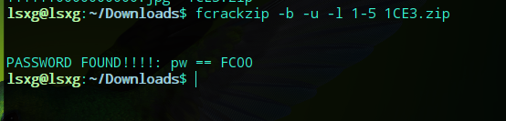
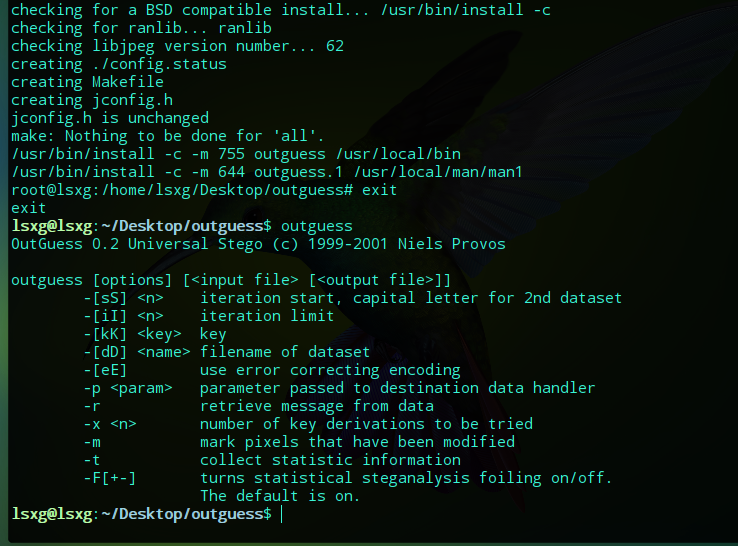

# 个工具使用

## binwalk

```bash
apt-get install binwalk  # 安装
```

- 自动化提取

```bash
binwalk -e filename  # 显示信息(图片)
```

- 递归提取

```bash
binwalk -Me filename
```

- 比较功能  
    Binwalk可以生成一个或多个文件的十六进制转储和差别。在文件当中相同字节的是绿色显示，不同的是红色显示，蓝色表示只是有些文件当中的不同部分。

```bash
binwalk -W firmware1.bin firmware2.bin firmware3.bin
```

与binwalk相似的还有dd、foremost

## Stegdetect

Stegdetect程序主要用于分析JPEG文件，可以检测到通过JSteg、JPHide、OutGuess、Invisible Secrets、F5、appendX和Camouflage等这些隐写工具隐藏的信息  

[github地址](https://github.com/abeluck/stegdetect)  | [我的网盘](https://pan.baidu.com/s/19UMUXXaxBZ2hFxioiQ395A)  

```bash
./configure && make && make install   # 安装失败了
```

- stegdetect参数  

`q – 仅显示可能包含隐藏内容的图像`  
`n – 启用检查JPEG文件头功能，以降低误报率。如果启用，所有带有批注区域的文件将被视为没有被嵌入信息。如果JPEG文件的JFIF标识符中的版本号不是1.1，则禁用OutGuess检测。`  
`s – 修改检测算法的敏感度，该值的默认值为1。检测结果的匹配度与检测算法的敏感度成正比，算法感度的值越大，检测出的可疑文件包含敏感信息的可能性越大。`  
`d – 打印带行号的调试信息。`  
`t – 设置要检测哪些隐写工具（默认检测jopi），可设置的选项如下：`
`j – 检测图像中的信息是否是用jsteg嵌入的。`  
`o – 检测图像中的信息是否是用outguess嵌入的。`  
`p – 检测图像中的信息是否是用jphide嵌入的。`  
`i – 检测图像中的信息是否是用invisible secrets嵌入的。`  

## Steghide

```bash
apt-get install steghide  # 安转
```

```bash
steghide embed -cf ./1111.jpg -ef ./embeddate  # 向图片中隐藏数据
```

```bash
steghide info ./1111.jpg  # 检查图片中的信息
```

```bash
steghide extract -sf filename  # 解压影藏数据
```

```bash
steghide embed -cf picture.jpg -ef secret.txt
```

然后设置密码。该命令将文件secret.txt嵌入到封面文件picture.jpg中。  

```bash
steghide info picture.jpg  # 查看隐藏信息
```

输入密码后就可以得到该文件的相关信息

## fcrackzip

```bash
apt-get install fcrackzip  # 安转
```

```bash
fcrackzip -b -u -l 1-5 1CE3.zip  # 爆破五位数密码的zip
```  

  
[fcrackzip的一些其他参数使用](http://ylq365.iteye.com/blog/1915531)  

## F5-steganography  

```bash
git clone https://github.com/matthewgao/F5-steganography
```

```bash
cd F5-steganography
```

```bash
java Extract ../123456.jpg -p 123456
```

后会生成output.txt文件，里面就有flag了

## MP3stego

将MP3文件和Decode.exe和Encode.exe放在同一目录下  
在命令行模式使用命令“cd 路径”进入该目录下（使用powershell打开）  
使用命令

```bash
Decode.exe -X -P password test.mp3  
```

其中 -X 提取隐藏数据，-P 密码 ，提取出来的信息在test.txt里面  
密码可能在文件本身或者网页前端代码或者响应头或者是弱密码  

## outguess

(深度操作系统)下载源码进行变异安装,源码不太好找[本人网盘](https://pan.baidu.com/s/18QZe48Ezpwm8IgteglYVxg)  | [github](https://github.com/crorvick/outguess)  
进入目录执行  

```bash
./configure && make && make install
```

安转成功  
  

将图片中隐藏的信息输出到a.txt中  

```bash
outguess -r angrybird.jpg -t a.txt
```

含密码的加密解密  
加密：hidden.txt中的内容是要隐藏的东西  

```bash
outguess -k "my secret key" -d hidden.txt demo.jpg out.jpg
```

解密：将内容解密到hidden.txt中  

```bash
outguess -k "my secret key" -r out.jpg hidden.txt
```

## ZipCenOp(zip伪加密)

```bash
java -jar ZipCenOp.jar e xxx.zip  # 加密
```

```bash
java -jar ZipCenOp.jar r xxx.zip  # 解密
```

## RoutePasswordView

加密route配置文件查看器