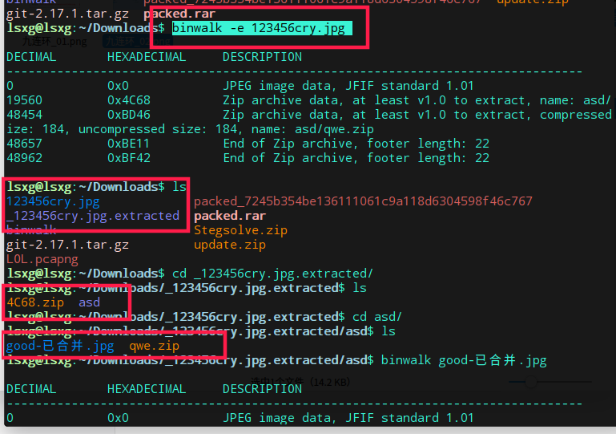
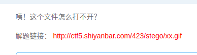
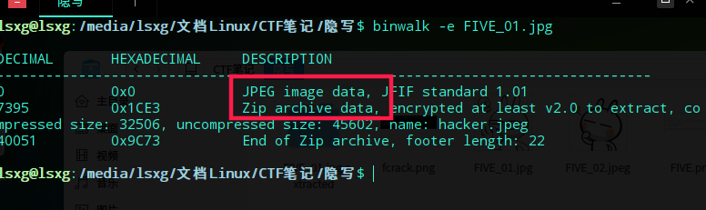
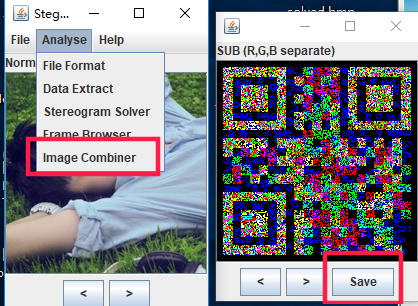

# 隐写

## 固定格式

- png头：89 50 4E 47 0D 0A 1A 0A  
    
- jpg头：ffd8 ffe0 0010 4a46 4946 0001 0100 0001开头，结束：ff d9  
- gif(notepad++打开、二进制打开)：GIF89a？、47 49 46 38 39 61结束标志:01 01 00 3B  
- jpeg  
  
- zip:50 48 03 04
- .7z:37 7a bc af 27 1c

## 类型

- F5隐写。  
  [F5隐写抛出github地址](https://github.com/matthewgao/F5-steganography
)  
执行：
    ```bash
    java Extract filename -p 123456   # -p后的参数？
    ```
- [base64与图片的转换](http://www.vgot.net/test/image2base64.php?)

## 九连环

  
下载附件是一个图片使用Setlove工具进行查看发现没有什么特别。
考虑到将后缀改为.zip，发现有东西  

使用binwalk命令解压

```bash
binwalk -e 123456cry.jpg
```

  
得到一个加密的zip和一副图，从图中解出zip的密码使用steghide查看图中隐藏的信息

```bash
steghide extract -sf good-已合并.jpg
```

  
得ko.txt文件，里面的就是zip的密码，最后得到flag.txt文件，解出密码。
  

## 打不开的文件

  
点击解题连接发现是一个无法打开的gif图片，将图片保存下来。  
  
使用notepad++打开，与普通的gif图片对比，发现正常gif是以***GIF89a***开头，而xx.gif中前面的GIF8被删了，补全后图片正常显示。  

## FIVE1

  
下载图片  
  
使用binwalk查看，发现藏有信息  
  
使用```steghide extract -sf ``` 将文件拆开，得到压缩包，需要密码，按题意密码应该是五位，用fcrackzip爆破  
  
得到新的图片jpeg  
  
继续是用binwalk，steghide分析没有什么结果.使用winhex或c32asm打开，发现最后有一段内容：`LS0uLi4gIC4tICAuLi4uLiAgLS0uLi4gIC4tICAuLi4uLiAgLi0gIC0tLi4uICAuLi4uLSAgLi4uLS0gIC0tLS4uICAtLS0tLiAgLi4uLi0gIC4tICAtLS0tLSAgLiAg`  
  
base64解码得到摩斯密码，继续解码得到：7A57A5A743894A0E还不是题目中的五位数。md5解码得到admin。  

## 刷新刷新快刷新

  
下载得到123456.jpg  
  
使用binwalk，steghide等分析，没有结果，有一个叫F5隐写的算法。在[github上下载得到一个解密的算法](https://github.com/matthewgao/F5-steganography)得到一个解密的算法git clone 一下代码进入代码文件夹执行

```bash
java Extract ../123456.jpg -p 123456  # -p后的参数？
```

得到 output.txt打开：flag{F5_f5_F5_Ez!!!}

## guess


## 黑与白

  
下载得到yhpargonagets.png看名字容易想到Image Steganography软件，使用Image Steganography软件解码得到乱码，说明应该有密码，QR扫描二维码得到：'我不会拼音'转五笔得到:'trntgiiwfcuruahujf',使用Steganography软件Decrypto得到结果  


## 最低位的亲吻

  
下载得到01.bmp  
  
题中给出了提示，最低位。用Stegsolve分析，将最低位的数据提取出来，发现没什么  
  
只能隐约看到二维码  
  
使用画图工具或ps工具将图片装换为.png格式[01.png](./隐写/01.png)。继续使用Stegslove打开  
  

## 复杂的QR_code

  
下载得到QR_code.png  
  
扫码得到：`secret is here
`显然不是结果  
使用binwalk分析  
  
发现含有zip文件，使用steghide需要密码，先得得到zip。  
用c32ams打开  
  
将图片使用Sublime打开，留下zip内容，将图片后缀该为.zip  
  
由文件名猜测是四位密码，使用fcrackzip暴力破解  
  

## 认真你就输了

  
下载得到一个[excel_data.xlsx](./隐写/excel_data.xlsx)  
用binwalk查看，发现里面很多zip文件。将后缀名改为.zip解压得到结果。  
  

## LSB

  
下载图片nvshen.jpg  
  
使用binwalk等工具没有什么结果,用wbstego工具，将结果输出到文件中，将得到的结果文件使用notepad++或c32Asm打开即可得到结果。  

## so beautiful so white

  
下载压缩包[white.zip](./隐写/white.zip)解压得到一幅图和zip  
StegSlove打开图片发现key，zip的密码  
  
解压zip得到gif打不开，用sublime打开，补全gif开头部分  
  
得到：key{forensics_is_fun}
CTF{AS3X}  

## SB!SB!SB

  
  

## 流

下载得到一个[liu.vmdk文件](./隐写/liu.vmdk),不是图片，音频，只好先尝试用c32Asm打开，搜索关键字ctf、flag、key  
  

## 女神又和大家见面了

[题目连接](http://www.shiyanbar.com/ctf/58)  
下载得到3.jpg  
  
binwalk查看发现zip，steghide解压需要密码，将其后缀改为.zip  
.mp3用mp3stego处理  

```bash
Decode.exe -X -P simctf music.mp3
```

  

## 水果

[题目连接](http://www.shiyanbar.com/ctf/1903)下载得到pic.png  
  
用StegSolve得到二维码  
  
数字转化ASCII：-.-. - ..-. .-.. ... -... ..--.- -... ... .-..  
摩斯解码：CTFLSB..--.-BSL  
有一个字符没解出来，对照摩斯密码表，还是没有，接下来就只能猜了，猜不对，换小写继续猜。  
  

## 想看正面?那就要仔细看

  
下载得到  
  
查看属性，base64解密。  

## 小苹果

  
下载得到图片，显然是二维码，扫码得到Unicode解码，当铺解密。  
  
  
  
binwalk发现rar，改后缀得到MP3，不是摩斯，用MP3stego解密。最后base64解密  
  

## stegas 300

  
下载得到[siri_audio.zip](./隐写/siri_audio.zip)解压得到音频，Audacity打开，发现波形，每8个波形一个空格，不是摩斯，转为二进制。解码  
  
  
MD5加密提交。  

## 无处不在的广告

  
下载得到下图  
  
  

## 男神一般都很低调

  
下载附件得到[男神.zip](./隐写/男神.zip)解压得到两张看似一样的图片，使用stegsolve的对比功能，得到二维码，QR-Reaserch扫码没结果，直接保存，继续使用stegsolve打开，发现是三张不同的二维码，分别扫码得到：  
`DES`  
`6XaMMbM7`  
`U2FsdGVkX18IBEATgMBe8NqjIqp65CxRjjMxXIIUxIjBnAODJQRkSLQ/+lHBsjpv1BwwEawMo1c=`  
DES解密得到结果  
  
  

## Chromatophoria

  
下载得到  
  
题目中有提示，是通过rgb信道来传递信息，直接用stegsolve得到结果  
  

## IHDR

  
下载得到[IHDR.png](./隐写/IHDR.png)，图片在deepin下显示为空白，在Windows下正常显示，说明图片的宽高发生了修改，改高度得到结果。  
  
  

## 会听歌吧

  
点开解题链接，下载音乐，就是普通的音乐，查看页面源码，发现下载链接是base64加密的，把download.php加密后放到连接处，能下载php文件  
  
  
打开发现里面有个hereiskey.php，base64加密后放到地址栏下载，得到php文件，打开就是key。  
  

## 当眼花的时候，会显示两张图

  
下载得到final.png，binwalk查看发现两张图片，分离，得到两张一样的图片，StegSolve打开对比，是黑色的，参考发现图片信息隐藏在r0通道里，把分离得到的图片用StegSolve打开，得到结果  
  
  

## [BugkuCTF训练平台](http://ctf.bugku.com/challenges)

### 隐写2.rar

  
下载得到[2.rar](./隐写/2.rar)解压得到2.png，用binwalk 似乎查看发现zip， -e
得到没用的东西，winhex查看，修改图片高度，得到结果。  
  
  
