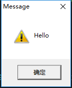
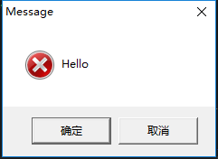
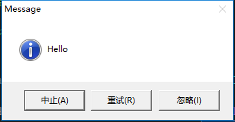

# Win32 编程笔记

## Win32必备基础

```c++
#include<windows.h>
/*
//1. void 指针集NULL
	1.1 void指针可以表示任何类型的数据
	1.2 不支持指针运算(++，--，+，-)
//2. Win32基本头文件
	2.1 <windows.h>必须包含
	2.2 <WINUSER.h> 窗口用户界面，GUI，控件
	2.3 <WINBASE.h>操作系统内核功能
	2.4 <WINGDI.h>图形设备接口，主要用来绘制图形
	2.5 <WINDEF.h>定义基本数据类型
	2.6 <WINNT.h>定义Unicode相关类型
//3. 匈牙利标记法：变量的命名规范
	3.1 类型缩写，一般以小写字母开头
//4. 句柄:Win32程序资源，是一个int型
	4.1 实例句柄、窗口句柄、图形设备句柄...
//5. 命令行
//6. 动态链接库
	6.1 dll一堆函数的集合，头文件中只有申明，没有定义
	6.2 实现函数共享
	6.3 增强扩展性
//7. WinMain参数
//8. MessageBox函数
	8.1 MessageBox(NULL, TEXT("Hello"),TEXT("Message"),MB_ABORTRETRYIGNORE);
	8.2 MB_ABORTRETRYIGNORE 终止、忽略、重试
	8.3 MB_OK 确定
	8.4 MB_OKCANCEL 确定、取消
	8.5 MB_RETRYCANCEL 重试、取消
	8.6 MB_ABORTRETRYIGNORE | MB_ICONERROR 错误图标
	8.7 MB_ICONEXCLAMATION 警告图标
	8.8 MB_ICONINFORMATION 信息提示
//9. swprintf函数使用
//10. Win32程序的编译、链接、运行
*/

int WinMain(HINSTANCE hInstance, HINSTANCE hPrevInstance,LPSTR lpCmdLine,int nCmdShow)
{
	MessageBox(NULL, TEXT("Hello"), TEXT("Message"), MB_OK | MB_ICONEXCLAMATION);
	MessageBox(NULL, TEXT("Hello"), TEXT("Message"), MB_OKCANCEL | MB_ICONERROR);
	MessageBox(NULL, TEXT("Hello"),TEXT("Message"),MB_ABORTRETRYIGNORE | MB_ICONINFORMATION);
	return 0;
}
```



