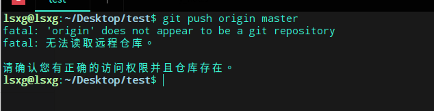
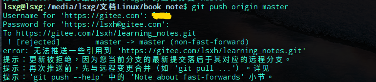

# 一个简单的演示（码云）

## 先在码云上创建一个项目

### 初始化git项目

```bash
git init
```

### 建立git分支

分支名：origin(自取)
url:在码云上创建的项目url

```bash
git remote add origin url
```

把本地文件加到git仓库

```bash
git add .
```

加commit信息

```bash
git commit -m "info"
```

推送

```bash
git push origin master
```

### ***注意:如果你使用了git init然后又使用git clone url提交的时候会提示仓库不可用***

**(使用git init 命令后会在当前目录下创建一个 .git 文件，再使用git clone url 会在当前目录下新建一个含有 .git 的文件夹，所以相当于使用git init创建的 .git 没有仓库)**



### ***注意:如果直接push也可能报错，你就要先pull一下，解除冲突，再强行push***



```bash
git pull origin master
```

```bsah
git push -u origin master
```
