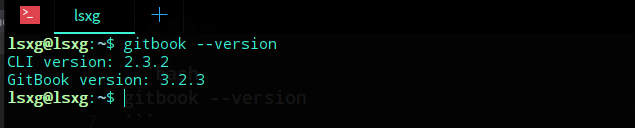
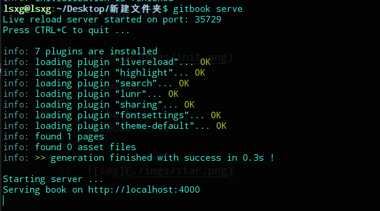
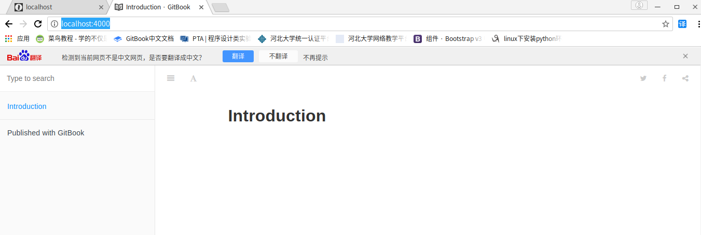

# 开始使用gitbook(介绍一些简单的命令)

* 查看版本

```bash
gitbook --version
```



* 更新

```bash
npm update gitbook-cli -g
```

* 卸载

```bash
sudo npm uninstall gitbook-cli -g
```

## 开始使用

* 初始化(进入要创建gitbook的目录)

```bash
gitbook init
```


* 启动服务

```bash
gitbook serve
```



* 预览，在浏览器输入地址(http://localhost:4000/)

