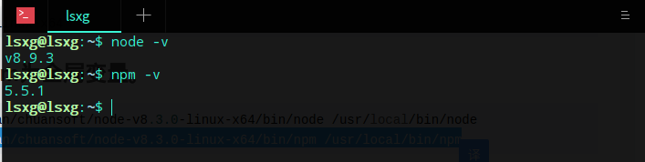

# gitbook、nodejs安装(linux)

## 安装nodejs

安装gitbook前要安装nodejs(nodejs 下的 NPM（node package manager），通常称为 node 包管理器。使用 NPM 可以对 node 包进行安装、卸载、更新、查看、搜索、发布等操作。)

* [官网下载](https://nodejs.org/zh-cn/)对应版本的压缩包
* 解压

```bash
tar -xvf   node-v6.10.0-linux-x64.tar.xz
```

* 将解压的文件放到你想要的文件夹，也可以直接放着。
* 设置node和npm为全局变量

```bash
ln -s /home/download/node-v8.3.0-linux-x64/bin/node /usr/local/bin/node
```

```bash
ln -s /home/download/node-v8.3.0-linux-x64/bin/npm /usr/local/bin/npm
```

* 测试是否安装成功(输入命令)

```bash
node -v
```

```bash
npm -v
```



## 安装gitbook

终端运行命令

```bash
sudo npm install gitbook-cli -g
```