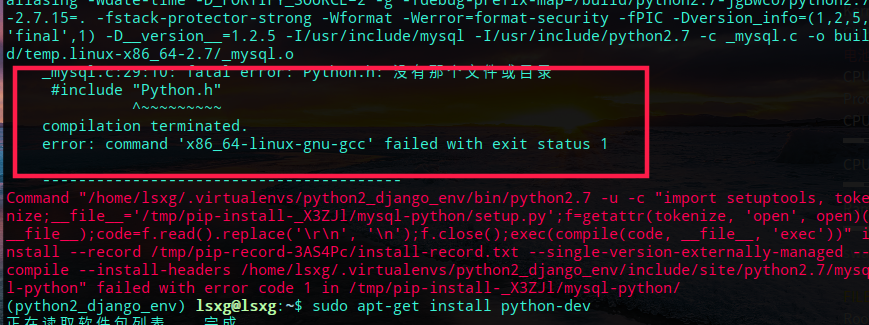

# python3 连接Mysql

## pymysql

- 安装pymysql

```bash
sudo pip3 install PyMySQL
```

- *使用 cursor.insert delete update 语句时，需要conn.commit()*

```python
# -*- coding:UTF-8 -*-
import pymysql
conn = pymysql.connect(host='192.168.1.104', port=3306, user='root',passwd='root', db='py3_mysql', charset='utf8')
# conn = pymysql.connect("192.168.1.104","user","password","dbname" )

#　执行简单的插入语句
cursor1 = conn.cursor()
sql = 'insert into test(name) VALUES ("liu")'
cursor1.execute(sql)  # 执行sql语句
conn.commit()  # 提交到数据库执行

# 使用预处理语句创建表
sql = """CREATE TABLE EMPLOYEE (
         FIRST_NAME  CHAR(20) NOT NULL,
         LAST_NAME  CHAR(20),
         AGE INT,  
         SEX CHAR(1),
         INCOME FLOAT )"""

cursor１.execute(sql)

# 关闭
cursor1.close()
conn.close()
```

- 参数化，可防止sql注入

```python
params = '低调小怪'
cursor1.excute('insert into test(name) VALUES (%s)',params)
```

- 将数据库操作封装成自己的类

```python
# -*- coding:UTF-8 -*-
# documents/PyMysqlClass.py
import pymysql

class MysqlM(object):
    """创建一个类，对数据库的操作做一定的封装"""
    def __init__(self, host, port, user, passwd, db, charset='utf8'):
        """初始化"""
        self.host = host
        self.port = port
        self.user = user
        self.passwd = passwd
        self.db = db
        self.charset = charset

    def open(self):
        """连接数据库,创建cursor"""
        self.conn = pymysql.connect(host=self.host, port=self.port, user=self.user, passwd=self.passwd, db=self.db, charset=self.charset)
        self.cursor = self.conn.cursor()

    def close(self):
        """关闭连接"""
        self.cursor.close()
        self.conn.close()

    def excute(self, sql, params):
        """执行sql语句,增删改"""
        try:
            self.open()
            self.cursor.execute(sql, params)
            self.conn.commit()
            self.close()
            print("Sql语句执行成功！")

        except Exception as e:
            print("sql语句执行出错！" + " " + e)

    def select(self, sql, params=[]):
        """查询数据"""
        try:
            self.open()
            self.cursor.execute(sql, params)
            result = self.cursor.fetchall()
            self.close()
            return result

        except Exception as e:
            print("Error: ", e)
# 在别的文件使用 from filename import MysqlM 导入这个类
# -*- coding:UTF-8 -*-
from PyMysqlClass import MysqlM

sql = "SELECT id,name FROM test"
m = MysqlM('192.168.1.104', 3306, 'root', 'root', 'py3_mysql', 'utf8')
m.open()
str = m.select(sql)  # select 方法
print(str)

sql = "INSERT INTO test(name) VALUES (%s)"
pamera = ['测试数据']
m.excute(sql,params)  # excute方法
```

- python2 安装MySQLdb  
    ```bash
    pip install mysql-python
    ```  
    如果报下面的错  
      
    ```bash
    sudo apt-get install python-dev
    ```  