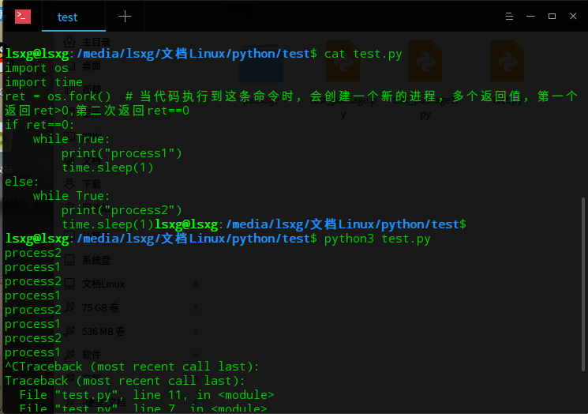
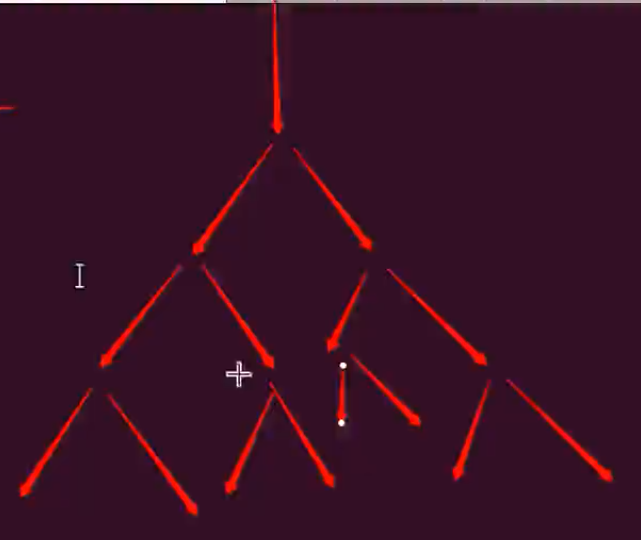
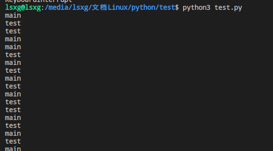

# 多进程

## 并行，并发

并发:感觉像多任务同时进行，实际内部并行执行
并行:多个进程同时执行
僵尸进程:
孤儿进程:

## fork 生成新的进程(父进程、子进程)

Windows中没有fork
***进程执行的优先级由系统决定***
一般的调度算法：时间片轮转，优先级调度

```python
import os
import time
ret = os.fork()  # 当代码执行到这条命令时，会创建一个新的进程，返回值即为PID，第一个返回ret>0(父进程),第二次返回ret==0(子进程)
if ret==0:
    while True:
        print("process1")
        time.sleep(1)
else:
    while True:
        print("process2")
        time.sleep(1)
# if 和 else 里的代码都会执行
```



### 多次使用fork

```python
import os
tep = os.fork()
if tep==0:
    print('1')
else:
    print('2')
tep = os.fork()
if tep==0:
    print('11')
else:
    print('22')
# 最后一共会产生四个进程print一次1、2，print两次11、22
```


```py
import os
os.fork()
os.fork()
os.fork()

print('1')
# 结果输出 8 个 1，原理下图
```

```py
import os
# fork炸弹
while True:
    os.fork()
```



- 进程之间互不影响，各自执行，进程中变量(全局、局部)也各自一份，一个进程修改了变量，但不会影响另一个进程中该变量的值
- 多进程缺点，数据不共享(进程之间的通信)

## multiprocessing(解决fork不够跨平台)

- Windows下没有fork，通过Process来实现多任务的跨平台。(不同平台下，py解释器使用不同的处理方式)

```python
from multiprocessing import Process
import time

def test():
    while True:
        print("test")
        time.sleep(1)

p = Process(target=test)  # 创建一个进程指向test
p.start()  # 开始执行进程

while True:
    print("main")
    time.sleep(1)

# 两个进程同时执行(实现多进程)
```



- Process的父进程会等子进程结束后再退出，Process此处不同与fork

- join子进程(堵塞，解堵塞)

```py
p = Process(target=test)
p.start()
p.join()  # 等待子进程结束后才会继续往下执行
p.join([timeout])  # 等待时间，若过了时间子进程还未结束，向下执行

p.terminate()  # 立即终止任务
```

### 进程池Pool先创建进程，用的时候直接用。

- 当添加的进程数大于进程池的容量时，并不会发生堵塞，而是根据最大进程数，执行所有任务
- 主函数不会等待所有子进程结束，会直接退出，所以要加上 join

```python
from multiprocessing import Pool
po = Pool(3)  # 定义一个进程池，允许的最大进程数为 3
po.apply_async(要调用的进程,(参数))  # 添加进程(非堵塞方式)，所有进程添加完后执行
po.apply()  # 添加进程(堵塞方式)，按进程池的容量添加，满了就执行，执行完再添加
po.close()  # 关闭进程池，关闭后不在接收进程
po.join()  # 等待 po 中所有进程结束，必须放在 close 后面
```

## 进程间通信Queue

- Process 创建进程间的通信

```python
from multiprocessing import Queue
q = Queue(3)  # 创建一个长度为3的队列
q.put()
q.put_nowait()  # 队列满了直接跳过，不等待
q.qsize()
q.get()
q.get_nowait()  # 队列满了为空跳过，不等待
q.full  # 判断队满
q.empty()  #对空
```

- Pool 进程池创建的进程间的通信

```python
from multiprocessing import Manager,Pool
# 进程池创建的进程实现通信使用 Manager().Queue
q = Manager().Queue()  # 使用Manager来初始化
# 使用与Queue创建的队列相同
```

## demo多进程拷贝文件

```python
# -*- coding:UTF-8 -*-
"""多进程拷贝文件"""
import os
from multiprocessing import Pool


def copy_file(name, old_file_name, new_file_name):
    fr = open(old_file_name+"/"+name)
    fw = open(new_file_name+"/"+name, "w")
    content = fr.read()
    fw.write(content)

    fr.close()
    fw.close()


def main():
    # 获取要拷贝的文件夹的名称
    old_file_name = input("输入要备份的问价名：")
    new_file_name = old_file_name+".bak"
    # 创建文件夹
    os.mkdir(new_file_name)  # os.rmdir() 删除文件夹
    # 读取所有文件
    file_names = os.listdir(old_file_name)
    # 使用多进程方式将文件内容写入新文件夹
    pool = Pool(5)
    for name in file_names:
        pool.apply_async(copy_file, args=(name, old_file_name, new_file_name))
    pool.close()  # 不再忘进程池里添加进程
    pool.join()  # 控制 让所有子进程结束后再退出程序

if __name__ == "__main__":
    main()
```

进一步改进，让程序可以判断是否完全备份

```python
# -*- coding:UTF-8 -*-
"""多进程拷贝文件"""
import os
from multiprocessing import Pool, Manager


def copy_file(name, old_file_name, new_file_name, queue):
    fr = open(old_file_name+"/"+name)
    fw = open(new_file_name+"/"+name, "w")
    content = fr.read()
    fw.write(content)
    fr.close()
    fw.close()
    queue.put(name)


def main():
    # 获取要拷贝的文件夹的名称
    old_file_name = input("输入要备份的文件夹路径：")
    new_file_name = old_file_name+".bak"
    # 创建文件夹
    os.mkdir(new_file_name)  # os.rmdir() 删除文件夹
    # 读取所有文件
    file_names = os.listdir(old_file_name)
    # 使用多进程方式将文件内容写入新文件夹
    pool = Pool(5)
    queue = Manager().Queue()

    for name in file_names:
        pool.apply_async(copy_file, args=(name, old_file_name, new_file_name, queue))
    """
     pool.close()  # 不再忘进程池里添加进程
     pool.join()  # 控制 让所有子进程结束后再退出程序
    """
    # 换一种方式进行判断文件是否写完
    num = 0
    all_num = len(file_names)
    while num < all_num:
        queue.get()
        num += 1
        copy_rate = num/all_num  # 复制百分比
        print("\r备份文件的进度：{}".format(copy_rate*100), end="")
        # print("\r备份文件的进度：%.2f%%"%(copy_rate*100), end="")

if __name__ == "__main__":
    main()
```