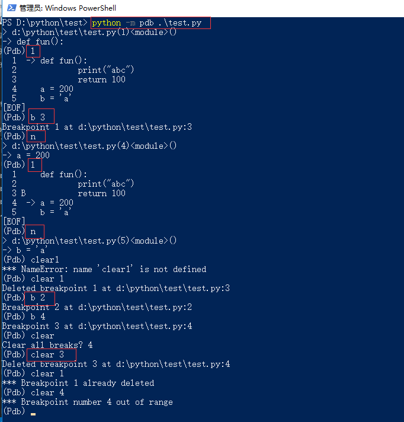

# pdb调试

## 调试py文件

```bash
python3 -m pdb test.py
```

- l:list列出当前的代码
- n:next下一行将要执行的代码
- c:continue继续执行代码
- b:break设置断点`(Pdb) b 4`让程序停在第四行
- clear 1:删除第一个断点
- s:step执行函数内的代码内容
- p a:print打印变量a的值
- a:arg打印形参的值
- q:退出



## 交互式调试

```python
import pdb
pdb.run('testfun(arg)')  #对testfun函数进行调试
```

## 在程序里埋点进行调试

当程序运行到pdb.set_trace()时会停下来调试

```python
import pdb
# 代码
pdb.set_trace()
# 代码
```

## 日志调试