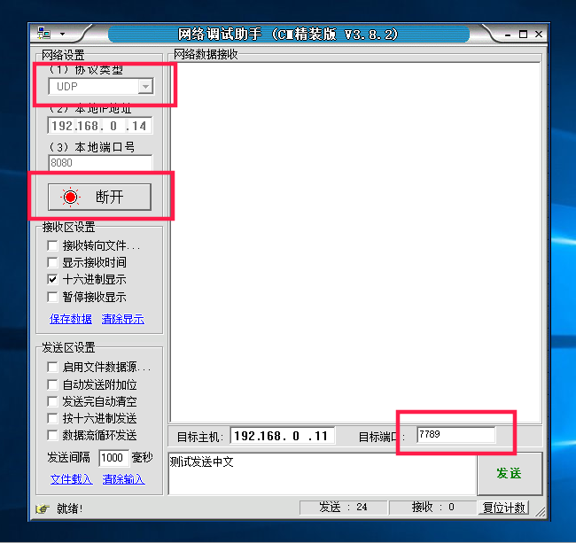
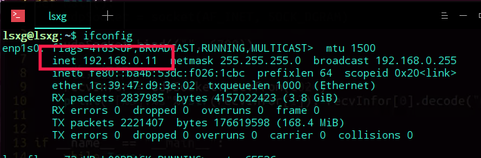
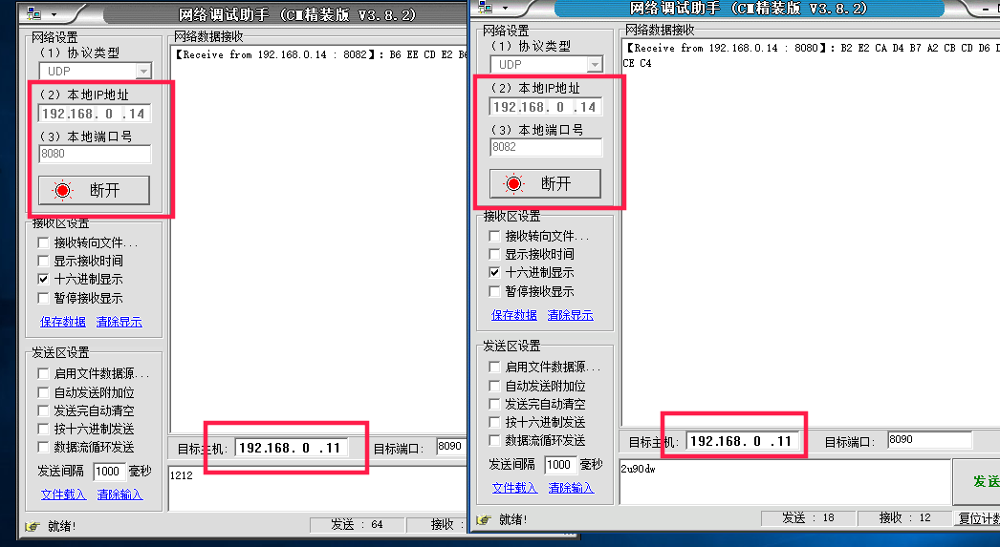
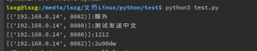
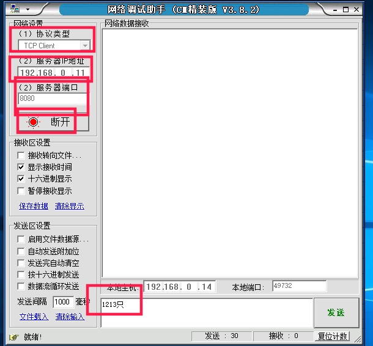
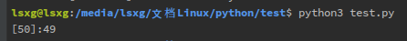
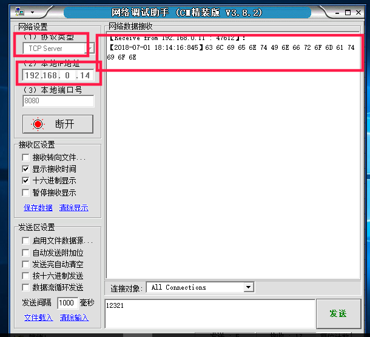
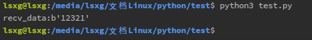

# socket(套接字)笔记

## 以下内容在deepin系统与Windows下的网络调试助手间完成

## UDP

进程间通信的一种方式，能实现不同主机间线程的通信

```python
import socket
# socket.socket为一个类，返回对象
# 创建 Tcp 套接字
t = socket.socket(socket.AF_INET, socket.SOCK_STREAM)
print(t)
# 创建 UDP 套接字
u = socket.socket(socket.AF_INET, socket.SOCK_DGRAM)
print(u)

# <socket.socket fd=3, family=AddressFamily.AF_INET, type=SocketKind.SOCK_STREAM, proto=0, laddr=('0.0.0.0', 0)>
# <socket.socket fd=4, family=AddressFamily.AF_INET, type=SocketKind.SOCK_DGRAM, proto=0, laddr=('0.0.0.0', 0)>
```

UDP协议向制定主机发送数据

```python
# -*- coding:UTF-8 -*-
import socket
u = socket.socket(socket.AF_INET, socket.SOCK_DGRAM)
addr = ("192.168.0.14", 8080)
data = "The data you want send"
# python2
u.sendto(data, addr)
# python3
u.sendto(data.enconde("gb2312")) # utf-8
u.sendto(b"shuju"， addr)
u.close()  # 关闭套接字
```

UDP协议接收数据

```python
from socket import *
u = socket(AF_INET, SOCK_DGRAM)
u.bind(("",7789))  # 绑定自己的IP,设置接收数据的端口
recv_data = u.recvfrom(1024)
content,dest_info = recv_data
print("content:%s"%content.decode("gb2312"))  # 解码
```




```python
from socket import *
def main():
    """聊天室"""
    rece_info = socket(AF_INET, SOCK_DGRAM)
    rece_info.bind(("", 8090))  # 绑定IP 设置端口
    while True:
        content = rece_info.recvfrom(1024)
        print("[%s]:%s"%(str(content[1]), content[0].decode("gb2312")))

if __name__ == "__main__":
    main()
```





多线程实现交互聊天

```python
# -*- coding:UTF-8 -*-
from socket import *
from threading import Thread

"""多线程实现交互聊天"""


def recv_data():
    while True:
        recv_info = udp_socket.recvfrom(1024)
        print(">>[%s]%s"%(str(recv_info[1]), recv_info[0].decode("gb2312")))


def send_data():
        while True:
            send_info = input("<<")
            udp_socket.sendto(send_info.encode("gb2312"), (dest_ip, dest_port))

udp_socket = None  # 定义全局变量
dest_ip = ""  # 对方的ip
dest_port = 0  # 对方的端口


def main():
    global udp_socket
    global dest_ip
    global dest_port
    dest_ip = input("对方的IP：")
    dest_port = int(input("对方的端口："))
    udp_socket = socket(AF_INET, SOCK_DGRAM)
    udp_socket.bind(("", 4567))  # 绑定自己的端口

    tr = Thread(target=send_data)
    ts = Thread(target=recv_data)

    tr.start()
    ts.start()

    tr.join()  # 等待子进程结束退出
    ts.join()

if __name__ == "__main__":
    main()
```

## TCP

```python
from socket import *
t = socket(AF_INET,SOCK_STREAM)  # 创建TCP套接字
t.bind(("",8080))  # 绑定电脑里的任何IP，并设置 8080 端口
t.listen(5)  # 设置监听最大为 5
t.accept()  # 返回一个元组 (client_socket,client_socket_info)
            # client_socket:返回新客户端的套接字
            # client_socket_info:对方的 ip 以及 port
t.connect()  # 连接
t.send()  #  udp使用sendto
t.recv()  #  udp使用recvfrom
t.close()
```

- serve(服务器)端

```python
#　服务器端
from socket import *
serve_socket = socket(AF_INET,SOCK_STREAM)  # 创建TCP套接字
serve_socket.bind(("",8080))  # 绑定电脑里的任何IP，并设置 8080 端口
serve_socket.listen(5)  # 设置监听最大为 5
# serve_socket.accept()  # 返回一个元组 (client_socket,client_socket_info)
            # client_socket:返回新客户端的套接字
            # client_socket_info:对方的 ip 以及 port
client_socket,client_socket_info = serve_socket.accept()  # 对结果进行解包
recv_data = client_socket.recv(1024) 　# 接收的数据,udp中使用 .recvfrom(1024)
print("[%s]:%s"%(str(recv_data[1]), recv_data[0]))
client_socket.close()
serve_socket.close()
```




- client(客户)端

```python
from socket import *
client_socket = socket(AF_INET, SCOK_STREAM)  # 创建TCP套接字
serve_addr = ("192.168.0.14", 8080)
clinet_socket.connect(serve_addr)
serve_socket.send("clientInfromation")
recv_data = serve_socket.recv(1024)
print("recv_data:%s"%recv_data)
serve_socket.close()
# 没有进行编码和解码
```




Web2 05