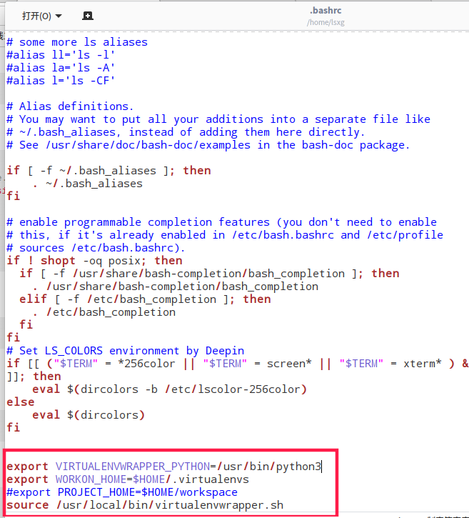

# 杂项

- Python可以直接对函数换名

```python
def fun():
    print('this is funnction')
    return
a=fun
a()  # 等价与 fun()
```

- 如果函数重名编译不报错，调用默认执行最后一次申明时的内容(要避免函数重名问题)  
- 在不引入其他变量的情况下，交换两个变量的值  

```python
# 只有Python可以
a,b = b,a
```

适合所以语言  

`
a = a+b;
b = a-b;
a = a-b;
`

- pycharm破解(deepin)  

 在hosts文件最后一行加上：0.0.0.0 account.jetbrains.com

```bash
sudo vi /etc/hosts
```

- type()测试数据类型，***可用于创建类***

```python
class A(object):
    pass
# 用type创建类(动态创建类)
B = type("B",(),{})  # ()内填继承的类，{}内填属性和方法，以字典
```

- 引用([-5,257)),intern共用机制id()查看地址

```python
# 在[-5,257)之间的整数，申明不同的变量也会指向相同的对象。intern针对不含空格的字符串，共用对象
# id(a)==id(b)
import sys
a = 1
b = 1
# id(a)==id(b)
a = 1
b = a
# 在超过[-5,257),id(a)!=id(b)
a = 1000
b = 1000
# 引用，id(a)==id(b)
a = 1000
b = a
sys.getrefcount(a)  # 查看a被引用的次数
```

- time.tiem() #记录当前时间  1529924632.6713235

## Garbage collection(GC模块垃圾回收)

c,c++使用malloc
申请内存，使用free释放内存，没有垃圾回收机制，Python，Java，c#有自己的垃圾回收机制。  
***Python以引用计数机制为主，隔代回收为辅来实现GC***  
引用计数机制能释放引用数为0的内存，但是对循环引用进行管理，所以使用链表进行隔代回收管理  
GC模块

```python
import gc
gc.disable()  # 关闭gc垃圾回收，默认是打开的
gc.enable()  # 开启gc
gc.isenable()  # 查看是否开启
gc.get_count()  # 获取当前自动执行垃圾回收的计数器，返回一个长度为三的列表
gc.get_threshold()  # 获取gc模块自动执行垃圾回收的频率(固定值(700,10,10))
```

- Tkinter 安装(deepin)
    ```bash
    sudo apt-get install python3-tk
    ```

- Tcp/ip：协议簇(eg:Tcp/ip/udp/arp...),四层模型，七层模型  
    ping->ICMP协议  
    arp->获取电脑网卡号(MAC地址)  
    ip：标记逻辑上的地址  
    MAC：标记实际转发数据时的设备地址
    netmask(网络掩码)：和ip一起确定网络号
    默认网关：发送数据的ip不在同一个网段时，数据会发送给默认网关
- 集线器、交换机(交换机具有学习的能力，集线器没有)
- 路由器(连接不同网段，交换机只能处理同一个网段下的信息，路由器连接交换机使不同网段之间进行通信)
- ip与mac地址:在不同网段的通讯过程中ip不变，路由器中mac地址发生变化  
- 原始字符串 r(raw)  
  `r"\nabc"`=>`"\\nabc"`
- 二进制 b(binary)
  `b"abc"`
- python3中md5库放到了hashlib中  
    `python2 import md5`
    `python3 import hashlib`

### virtualenv 简单使用介绍  

- 安装  
  
    ```bash
    pip install virtualenv 或 sudo apt-get install virtualenv
    ```

- 创建一个虚拟的环境，并命名env1。如果文件夹含中文名称，将会报错  

    ```bash
    virtualenv env1  # 默认Python2.7
    virtualenv -p python3 env1  # 指定Python3
    ```
- 进入虚拟环境 在env1目录下

    ```bash
    source env1/bin/activate
    ```
- 离开虚拟环境

    ```bash
    deactivate
    ```
- 安装virtualenvwrapper
    ```bash
    sudo pip3 install virtualenvwrapper
    ```
- 配置
    ```bash
    sudo gedit ~/.bashrc
    ```
    添加  
    export WORKON_HOME=$HOME/.virtualenvs  # 虚拟环境将安装到这个目录下
    source /usr/local/bin/virtualenvwrapper.sh  
  - 如果你是使用的pip3 安装的virtualenvwrapper，而系统默认使用python2.7，上面将会报错，需要在 ～/.bashrc 中加入VIRTUALENVWRAPPER_PYTHON=/usr/bin/python3  
      
  - 可以使用workon来切换虚拟环境
  - 删除虚拟环境
    ```bash
    rmvirtualenv venv
    ```
- python3连接数据库(python3 只支持pymysql)  
  python3中不支持MYSQLdb，以及python-mysql，使用pip安装这两会报错，所以在使用django创建app的时候也会报错。此时应该在`__init__.py`文件中加入两句话：  
  import pymysql  
  pymysql.install_as_MySQLdb()  
  